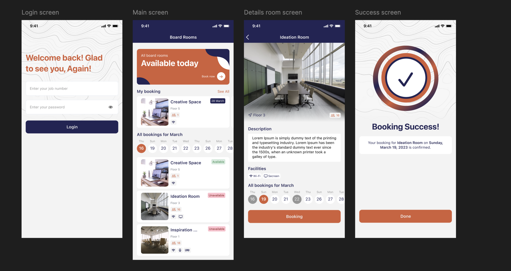

iOS Boardroom Booking App 
BoardRoom is an iOS application that allows employees to view available boardrooms, book rooms, and manage reservations in a simple and intuitive interface.
The app is built using SwiftUI ensuring scalability and maintainability.

🏗 Architecture
The project follows MVVM (Model–View–ViewModel):
View  →  ViewModel  →  Service  →  APIClient  →  Backend
To ensure clear separation between UI and business logic. and provide easier testing and maintenance.

🌐 Networking Layer
The networking layer is centralized and reusable, designed to work with any API endpoint.
1) APIClient
- Singleton (APIClient.shared)
- Supports GET, POST, PATCH, DELETE
- Uses Swift async/await
- Automatically injects authorization headers
- Decodes JSON into Swift models using generics
2) APIError
A unified error-handling system that maps:
- Network failures
- HTTP status codes (401, 404, 5xx)
- Decoding issues
Into user-friendly error messages.
3) Endpoints
All API URLs are defined in one place:
- Prevents duplication
- Makes changes easy and safe
- Keeps ViewModels clean

🔐 User Session Management
UserSession:
- Stores logged-in employee ID
- Allows quick login checks without API calls

🎨 User Interface
- Login & authentication flow
- Boardroom listing with availability
- Room detail with calendar booking
- Booking confirmation & success screen
- Reusable UI components (calendar, chips, navigation bar)
Built entirely using SwiftUI, following modern iOS design principles.

🔑 Configuration & Secrets
Sensitive data such as:
- API keys
- Base URLs
- Authorization headers
are stored in Secrets.swift, which is excluded from version control via .gitignore.

